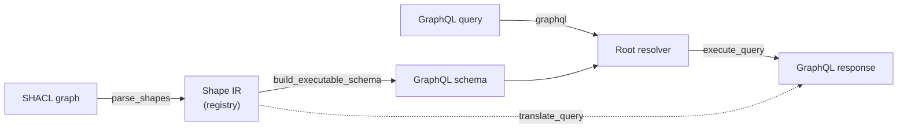

[](https://pypi.org/project/fastshaql/)
[](https://pypi.org/project/fastshaql/)
[](LICENSE)
[](https://github.com/robsyc/fastshaql/actions/workflows/ci.yml)
[](https://github.com/astral-sh/ruff)
[](https://raw.githubusercontent.com/robsyc/fastshaql/badges/coverage.json)
[](https://raw.githubusercontent.com/robsyc/fastshaql/badges/mutants.json)
[](https://raw.githubusercontent.com/robsyc/fastshaql/badges/complexity.json)

# FastSHAQL

`fastshaql` turns a SHACL shapes graph into a GraphQL schema and translates GraphQL queries into SPARQL; it provides an operational, frontend-friendly interface over any RDF-based and SHACL-described knowledge graph. Point it at a shapes graph and a SPARQL store, get a typed GraphQL (read-only) endpoint. The Core is framework- and transport-neutral; the FastAPI and Django adapters and the async httpx SPARQL store ship as optional extras (`fastapi`, `django`, `httpx`).

**Key features:**
- Single- and multi-value properties
- Literal objects and relationship traversal
- Rich filtering and pagination
- Derived fields relationships w/ SHACL 1.2 node-expressions
- Language- and named graph-selection per request



The full lifecycle (startup vs. runtime processes, every entry point w/ file references) is in [docs/ARCHITECTURE.md](docs/ARCHITECTURE.md).

## Quickstart

Install from PyPI with the extra matching your stack — `uv add "fastshaql[extra]"` or `pip install fastshaql[extra]`:

**FastAPI:** `pip install fastshaql[fastapi]` then wire a store via `context_getter`

```python
from fastapi import FastAPI
from fastshaql import build_executable_schema, load_shapes, parse_shapes
from fastshaql.adapters.fastapi import build_graphql_router
from fastshaql.core import InMemoryStore, ResolverContext

shapes = load_shapes("shapes.ttl")
schema = build_executable_schema(parse_shapes(shapes))
store = InMemoryStore(data_graph)

def get_context() -> ResolverContext:
    return ResolverContext(store=store)

app = FastAPI()
app.include_router(build_graphql_router(schema, get_context))
```

**Django:** `pip install fastshaql[django]` then wire a store via `get_context`

```python
from django.urls import path
from fastshaql.adapters.django import build_graphql_view

GraphQLView = build_graphql_view(schema, get_context, ide=True)

urlpatterns = [
    path("graphql/", GraphQLView.as_view()),
]
```

**Remote triple store:** `pip install fastshaql[httpx]`, then swap `InMemoryStore` for `HttpxSparqlStore` from `fastshaql.stores.http` — it wraps your own `httpx.AsyncClient` (pooling, time-outs, caching are configured on that client) and any SPARQL query endpoint. The store is framework-neutral: any adapter's context getter (`context_getter`, `get_context`) can serve it. Reference wiring: `demo/server.py`.

**Developer tour:** clone the repo and take the guided tour — a small library-domain knowledge graph exercising nearly every feature (optionally replace `demo/quickstart/` with your own shapes and data):

```
git clone https://github.com/robsyc/fastshaql.git
cd fastshaql && just sync && just demo
# goto: http://localhost:8000/graphql — then follow demo/README.md
```

## Documentation

- [Architecture](docs/ARCHITECTURE.md) — pipeline, deep modules, full file-structure map
- [Support matrix](docs/SUPPORT.md) — what is supported against the SHACL/SPARQL spec, and in which interpretation
- [Contributing](CONTRIBUTING.md) — development setup, style, testing, release
- [Domain glossary](CONTEXT.md) — ubiquitous language used throughout the codebase
- [Decision records](docs/adr/) — the "why" behind every architectural choice
- [Roadmap](docs/ROADMAP.md) — shipped / in-flight / future features
- [Citation](CITATION.cff)

## License

MIT — see [LICENSE](LICENSE).