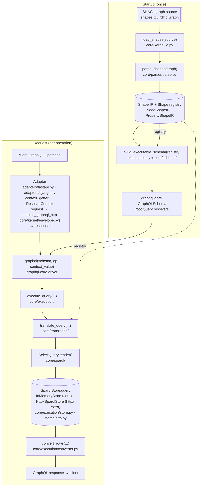
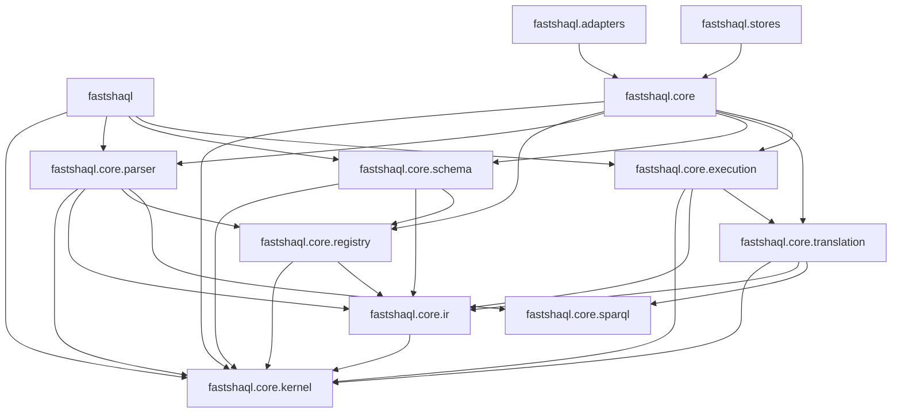

# Architecture

This document is the **navigation source-of-truth** for the fastshaql codebase: a module map plus a request-flow diagram. Its audience is a contributor (human or coding agent) who needs to find the right module and understand how a request flows through it. It covers *where things live* and *how a request moves* — nothing else.

## Pipeline

The diagram below expands the README's simplified pipeline into the full lifecycle. Two phases: **startup** (load, parse, build — run once) and **request** (per GraphQL Operation). Solid edges are data and control flow; dotted edges are the **Shape registry**, produced once at parse time and then closed over — by `build_executable_schema` at startup and by `translate_query` at request time for relationship resolution.



Each row in the table below is a **deep module** — one public entry point hiding significant complexity. Tests target these interfaces, not internals.


| Stage       | Entry point                                                | Go deeper                                                                                 |
| ----------- | ---------------------------------------------------------- | ----------------------------------------------------------------------------------------- |
| Load        | `load_shapes(source)`                                      | `core/kernel/io.py`                                                                       |
| Parse       | `parse_shapes(graph)`                                      | `core/parser/`, `core/ir/`                                                                |
| Schema      | `build_executable_schema(registry)`                        | `core/schema/`, `executable.py` (the package-root composition root)                       |
| Request     | `await graphql(schema, op, context_value=ResolverContext)` | graphql-core; the **Adapter** injects the **Store** + `QueryContext` via `context_getter` |
| Execute     | `await execute_query(...)`                                 | `core/execution/query.py`                                                                 |
| ↳ Translate | `translate_query(...)`                                     | `core/translation/query.py`                                                               |
| ↳ Render    | `SelectQuery.render()`                                     | `core/sparql/queries.py`                                                                  |
| ↳ Store     | `await store.query(sparql)`                                | `core/execution/store.py`                                                                 |
| ↳ Convert   | `convert_rows(rows, shape, var_map, registry)`             | `core/execution/converter.py`                                                             |

## Module map

Module boundaries are enforced by [tach](https://docs.gauge.sh/) (`just architecture`, `tach.toml`): the DAG below, plus pinned public interfaces at exactly three seams — the root package (three entry points), `fastshaql.core` (the advanced surface), and `fastshaql.adapters` (the two builders). Regenerate with `just module-graph` after changing `tach.toml`.



### `src/fastshaql/` — package root

The public facade (`__init__.py` — the three entry points, CONTEXT.md "Public API"), the composition root, and the optional-dependency leaves:

```
src/fastshaql/
├── __init__.py            # the three entry points: parse_shapes, build_executable_schema, load_shapes
├── executable.py          # build_executable_schema — wires core/schema + core/execution resolvers
├── adapters/              # thin framework wrappers (ADR-0001)
└── stores/                # optional-dependency stores (ADR-0018)
```

### `src/fastshaql/core/` — the framework-neutral Core

No FastAPI / Django imports live here. Every entry point in the table above is in Core.

```
src/fastshaql/core/
│
├── registry.py             # ShapeRegistry + visibility resolution (resolve_visibility, VisibilityMap — ADR-0008)
|
├── kernel/                 # Shared leaves — consumed by every core stage
│   ├── constants.py        # Shared constants (IRI_FIELD, synthetic URN prefixes, etc.)
│   ├── context.py          # QueryContext — cross-cutting request parameters (`lang_tags` chain, `read_graphs` → `FROM`, reserved `write_graph`)
│   ├── envelope.py         # GraphQL-over-HTTP envelope + shared adapter orchestration (execute_graphql_http)
│   ├── identifiers.py      # local_name + GraphQL enum naming — shared by parser, schema, translation
│   ├── operators.py        # Filter operator registry — shared by schema + translation
│   └── io.py               # load_shapes — files/URLs/inline/directories → rdflib.Graph
│
├── ir/                     # Shape IR — frozen dataclasses
│   ├── base.py             # ShapeIR (sh:Shape common fields)
│   ├── node_shape.py       # NodeShapeIR (sh:NodeShape)
│   ├── node_expr.py        # NodeExprIR (sh:values node expressions)
│   ├── filter_shape.py     # FilterShapeIR + FilterConstraintIR
│   ├── property_shape.py   # PropertyShapeIR (sh:PropertyShape) + FieldKind + ValueType/ValueSource + LiteralSpace
│   └── shacl_path.py       # ShaclPropertyPath (sh:path, not SPARQL)
│
├── parser/                 # SHACL shapes graph → Shape IR
│   ├── parse.py            # parse_shapes — three-pass parse + cross-ref resolution
│   ├── node_shape.py       # Parse sh:NodeShape → NodeShapeIR
│   ├── targets.py          # Parse sh:target* declarations — one per shape (ADR-0016)
│   ├── property_shape.py   # Parse sh:PropertyShape → PropertyShapeIR — sh:class/sh:node
│   ├── shacl_in.py         # Parse sh:in → homogeneous term tuple
│   ├── shacl_path.py       # Parse sh:path → ShaclPropertyPath (full grammar)
│   ├── errors.py           # UnsupportedShapeError — the parser-wide loud-rejection error
│   ├── node_expr/          # Parse node expressions → NodeExprIR (ADR-0015)
│   │   ├── parse.py        # sh:values dispatch — one _FUNCTIONS table
│   │   ├── filter_shape.py # Parse shnex:filterShape conjuncts (lowerable subset)
│   │   ├── semantics.py    # Union knowledge: arm_label, reject_derived_path_targets
│   │   ├── select_scan.py  # sh:select body extraction, modifier + validation
│   │   └── shacl_prefixes.py # sh:prefixes → prefix map; expand_sparql_prefixes
│   └── util/               # Parser utilities
│       ├── graph_reads.py  # typed RDFLib reads (object_str/int/uri, rdf_list, localized str)
│       ├── identifiers.py  # graphql_type_name + graphql_field_name (sh:codeIdentifier)
│       └── namespaces.py   # SH/SHNEX term constants absent from RDFLib's SH namespace
│
├── schema/                 # Shape IR → graphql-core GraphQLSchema
│   ├── build.py            # build_schema — root Query assembly
│   ├── _gql.py             # graphql-core cast helpers
│   ├── types.py            # build_object_type — GraphQLObjectType from NodeShapeIR
│   ├── enums.py            # GraphQLEnumType + per-enum filter inputs from sh:in
│   ├── fields.py           # build_field, wrap_field_type — Relationship + Scalar fields
│   ├── filters.py          # build_operator_inputs, build_filter_type — where inputs
│   └── scalars.py          # DATATYPE_MAP, DATATYPE_CATEGORIES, datatype_category, resolve_scalar_type
│
├── execution/              # Execution layer
│   ├── query.py            # execute_query — translate → render → store → convert pipeline
│   ├── store.py            # SparqlStore protocol + InMemoryStore; decode_sparql_results (the wire-decode seam); ResolverContext
│   └── converter.py        # convert_rows — recursive grouping with VariableMap + coerce_value
│
├── translation/            # GraphQL AST → SPARQL queries
│   ├── query.py            # translate_query — root orchestration; target emission
│   ├── selection.py        # translate_selection — recursive field walk (ADR-0009)
│   ├── where_assembly.py   # assemble_where — flat vs paginated WHERE (ADR-0010)
│   ├── field_binding.py    # field binding, relationship joins, promotion
│   ├── node_expr.py        # translate_node_expr — node expression → graph patterns (ADR-0016)
│   ├── filter_shape.py     # translate_filter_shape — conjuncts → joins + FILTERs
│   ├── patterns.py         # shared SPARQL pattern emission (scalar binds, language-preference)
│   ├── joins.py            # relationship_join_patterns, relationship_type_patterns
│   ├── scope.py            # TranslationScope — mutable per-level scope state
│   ├── filters/            # where argument → expression AST; promotion pre-scan
│   │   ├── walk.py         # walk_where + PromotionCollector
│   │   ├── extract.py      # extract_where/pagination args, compute_promoted_fields
│   │   ├── context.py      # concrete contexts (RootFilterContext vs ExistsContext)
│   │   ├── fields.py       # translate_fields — where argument → patterns/expressions
│   │   ├── dispatch.py     # translate_where_filter (root where → patterns)
│   │   ├── exists.py       # FILTER EXISTS block construction
│   │   ├── operators.py    # operator → expression AST; AND/OR combining
│   │   ├── literals.py     # GraphQL value → rdflib Literal coercion
│   │   ├── naming.py       # EXISTS-internal variable names
│   │   └── strategy.py     # FilterContext protocol — the strategy interface (depended on)
│   ├── paths.py            # map_shacl_path_to_sparql_path
│   └── variables.py        # VariableAllocator, VariableMap, TranslationResult
│
└── sparql/                 # SPARQL lexer + composite tree + rendering
    ├── lex.py              # §19 trusted-text lexer (shared by parser + translation)
    ├── terms.py            # RenderTerm, render_term() — RDFLib n3() emission (injection chokepoint)
    ├── paths.py            # Property path AST (predicate, inverse, sequence, alternative; cardinality modifiers ZeroOrMorePath/OneOrMorePath/ZeroOrOnePath)
    ├── patterns.py         # TriplePattern, GroupPattern, OptionalPattern, FilterPattern, BindPattern, ValuesPattern, RawGraphPattern
    ├── expressions.py      # CompareExpr, FunctionCall, InExpr, AndExpr, OrExpr, NotExpr, ExistsExpr, TermExpr, RawSparqlExpr
    └── queries.py          # SelectQuery — `from_default` dataset clauses (grammar [9], top-level only)
```
